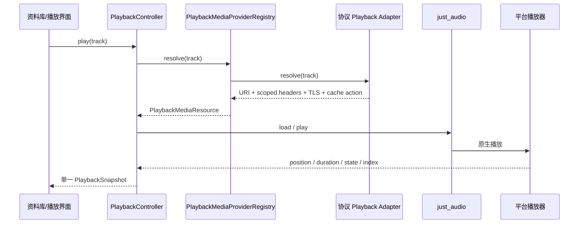

# 开听 架构设计图

最后审查：2026-07-15

## 总体结构

```mermaid
flowchart TB
  subgraph UI["Presentation · 界面与交互"]
    Shell["AppShell / Settings"]
    LibraryUI["资料库 · 搜索 · 收藏 · 播放列表"]
    PlayerUI["迷你播放器 · 正在播放 · 歌词 · 队列"]
    SourceUI["来源设置 · 通用目录选择器"]
    OfflineUI["下载中心"]
  end

  subgraph Product["Product controllers · 协议无关用例"]
    Catalog["LibraryCatalogController"]
    Playback["SoundPlaybackController"]
    Offline["OfflineDownloadController"]
    UserState["LibraryUserStateController"]
  end

  subgraph Contracts["Provider contracts · 扩展边界"]
    SourceDef["SourceProviderRegistry\n身份与能力"]
    Connection["SourceConnectionProviderRegistry\n连接生命周期"]
    Browser["SourceDirectoryBrowser\n目录树"]
    Scanner["SourceScanProviderRegistry\n扫描与变更摘要"]
    Media["PlaybackMediaProviderRegistry\n可播放资源"]
    OfflineProvider["OfflineMediaProvider\n固定离线内容"]
  end

  subgraph Core["Domain / persistence"]
    Models["Track · Album · SourceKind\n开放字符串标识"]
    Repository["LibraryRepository"]
    SQLite["Drift / SQLite v3"]
    Session["Playback session v3\n结构 + checkpoint"]
  end

  subgraph Adapters["Protocol adapters"]
    Local["Local\n授权 · 扫描 · 直接播放"]
    WebDAV["WebDAV\n连接 · 浏览 · 扫描\n播放解析 · 离线缓存"]
    Future["未来协议\nSubsonic / SMB / S3 …"]
  end

  subgraph Platform["Platform adapters"]
    Audio["just_audio\nAVPlayer / ExoPlayer / WinRT"]
    Files["Files / SAF / security bookmark"]
    Secure["Keychain / secure storage"]
    MediaControls["后台播放 / 系统媒体控制"]
  end

  UI --> Product
  SourceUI --> SourceDef
  SourceUI --> Connection
  SourceUI --> Browser
  SourceUI --> Scanner
  Playback --> Media
  Offline --> OfflineProvider
  Catalog --> Repository
  UserState --> Repository
  Playback --> Session
  Repository --> SQLite
  Product --> Models

  Local --> Connection
  Local --> Scanner
  Local --> Media
  WebDAV --> Connection
  WebDAV --> Browser
  WebDAV --> Scanner
  WebDAV --> Media
  WebDAV --> OfflineProvider
  Future -. "新增适配器，不修改共享控制器" .-> Contracts

  Media --> Audio
  Local --> Files
  WebDAV --> Secure
  Playback --> MediaControls
```

## 一首远程歌曲的链路

## 新增协议的实现清单

新协议只需要提供以下适配器，领域模型、资料库页面、播放器控制器和下载控制器不增加协议判断：

1. `SourceProviderDefinition`：名称与能力声明。
2. `SourceConnectionProvider`：观察、探测、浏览入口和删除。
3. `SourceDirectoryBrowser`：协议目录映射。
4. `SourceScanProvider`：元数据扫描并写入 `LibraryRepository`。
5. `PlaybackMediaProvider`：把歌曲解析成播放器资源。
6. 需要离线时实现 `OfflineMediaProvider`。
7. 在组合根注册适配器，并提供该协议自己的添加/编辑连接表单。

## 审查结论

- 依赖方向合理：共享控制器不导入 WebDAV，协议代码依赖共享 contract。
- 凭据边界合理：认证信息不进入 `Track`、SQLite 曲目或播放会话。
- 播放状态合理：原生引擎是进度和切歌的唯一事实来源。
- 来源标识可扩展：未知 provider ID 可经过 SQLite、会话和界面模型。
- 来源设置由远程适配器列表驱动；连接表单保持协议专属，不使用复杂动态 schema。
- 资料库与“我的音乐”来源筛选根据真实 `SourceKind` 动态生成，不再固定枚举本地/WebDAV。
- 契约测试用第二协议标识同时穿过连接、浏览、扫描、播放与离线边界。

目前没有必要继续抽象扫描器内部的所有实现。下一种真实协议接入时，再根据实际重复代码抽取共享扫描入库管线，避免提前设计错误的万能接口。
